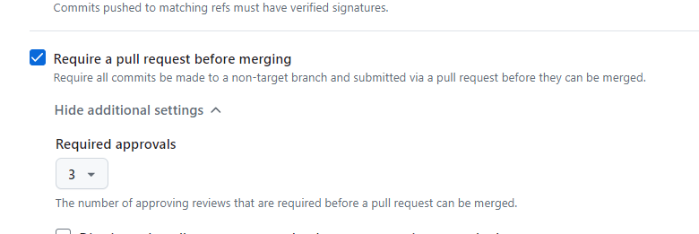

### Question & Answers :

#### 1) How to assign whenever merging code(open pull request) to be checked automatically by 3 people and review the code? 

**Ans**:  Create a Repository (if not already done):

1) Go to GitHub and create a new repository or use an existing one.
2) Add Collaborators:
    * Ensure the three reviewers are added as collaborators to your repository. Go to your repository, click on "Settings" > "Manage access" > "Invite a collaborator".
3) Set Up Branch Protection Rules:
    * Go to the "Settings" tab of your repository.
    * Under "Branches", click on "Add branch ruleset" to create a new branch protection rule.
    * Specify the branch name pattern (e.g., main or develop).
    * In branch protections
        * Enable "Require pull request reviews before merging".
        * Set "Required approving reviews" to 3.
        
        * Optionally, enable "Dismiss stale pull request approvals when new commits are pushed".
        * Optionally, enable "Require review from Code Owners" if you have a CODEOWNERS file.
    * Click "Create" or "Save changes".
4) Using a CODEOWNERS File:

    * In the root of your repository, create a file named CODEOWNERS.
    Specify the paths and reviewers. For example:
    ```
    # Specify the reviewers for all files
    * @reviewer1 @reviewer2 @reviewer3

    # Specify the reviewers for specific paths
    /path/to/folder @reviewer1 @reviewer2

    # Specific folders or files
    /src/ @reviewer1 @reviewer2
    /docs/ @reviewer3

    # Specific file types
    *.js @reviewer1
    *.md @reviewer3
    ```
   This file ensures that the specified reviewers are automatically requested for review.

   Verifying the CODEOWNERS File

5) After creating the CODEOWNERS file:

    * Create a Pull Request:

        * Make a change in your repository and create a pull request.
        * You should see that the specified code owners are automatically requested for review.

    * Check Branch Protection Rules:

        * Ensure that branch protection rules are set up to require reviews before merging. This can be done in the "Settings" > "Branches" section of your repository.


