### **How to start and stop EC2 Instances Automatically** ?

* AWS Documentation [Referhere](https://repost.aws/knowledge-center/start-stop-lambda-eventbridge)
* Other Reference [Referhere](https://k21academy.com/amazon-web-services/automate-start-stop-aws-ec2-instance/#:~:text=add%20a%20trigger-,1.,and%20click%20on%20Add%20Trigger.&text=EventBridge%20(CloudWatch%20Events)-,3.,Rule%20type%20as%20Schedule%20expression.)


### **Prerequisites**:

1) Setting up an AWS IAM Role and IAM Policy
2) Creating an AWS EC2 Instance
3) Configuring a Lambda Function
4) Configuring EventBridge
5) Verifying the Lambda Function & EventBridge Rule.

**Create IAM Policy**

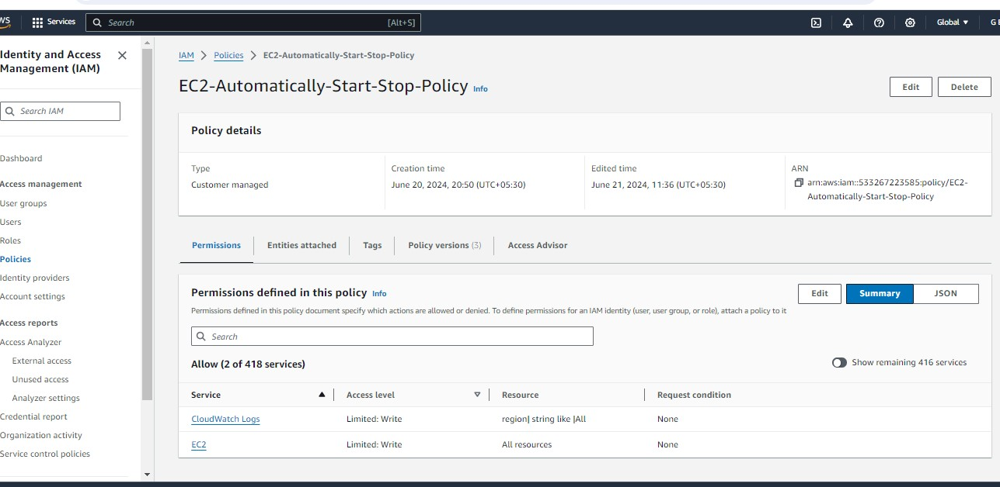

**JSON Policy**

Policy to Start and Stop instance.

```
{
    "Version": "2012-10-17",
    "Statement": [
        {
            "Effect": "Allow",
            "Action": [
                "logs:CreateLogGroup",
                "logs:CreateLogStream",
                "logs:PutLogEvents"
            ],
            "Resource": "arn:aws:logs:*:*:*"
        },
        {
            "Effect": "Allow",
            "Action": [
                "ec2:Start*",
                "ec2:Stop*"
            ],
            "Resource": "*"
        }
    ]
}
```
Add also another custom inline IAM policie for sns

```
{
	"Version": "2012-10-17",
	"Statement": [
		{
			"Effect": "Allow",
			"Action": "sns:Publish",
			"Resource": "arn:aws:sns:us-east-1:533267223585:rdss3lambda_snstopic"
		}
	]
}

```
**Create a Role for Lambda and attach created policies to this role**

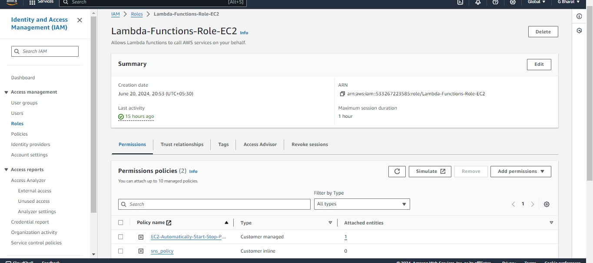

**Create EC2 Instance:**

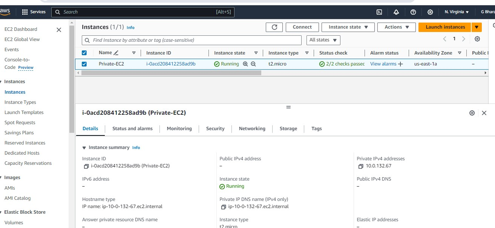

**Configure Lambda:**

Two Functions we need to create in AWS Lambda :

 *  Function-1 for Starting Instance and need to add trigger after creating function.
 *  Function-2 for Stopping Instance and need to add trigger after creating function. 

1) Goto AWS Lambda --> Click **Create Function**
2) Choose **Author from scratch** 

    --> Basic Information - Function Name 
    
    --> Select Runtime - > ```Python 3.9```

    --> Select **existing role** which is created.

    
    

    Create Function for Starting Instance.
3) Select Function --> On the Code tab, under **Code** source , paste the following code  

**Note**: change instance id and region

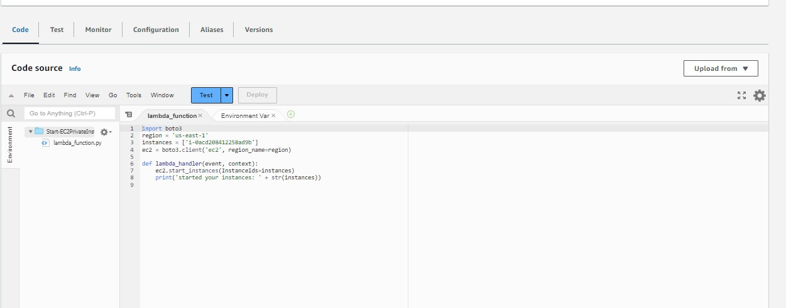


```
    import boto3
    region = 'us-east-1'
    instances = ['i-0acd208412258ad9b']
    ec2 = boto3.client('ec2', region_name=region)

    def lambda_handler(event, context):
        ec2.start_instances(InstanceIds=instances)
        print('started your instances: ' + str(instances))
```

4) Choose **Deploy**.
5) On the **Configuration** tab, choose General configuration, and then choose Edit --> Set Timeout to 10 seconds, and then choose **Save**.
6) Now , Click **Test** your Lambda functions

    *  Open the Lambda console, and then choose Functions.
    * Choose one of the functions.
      Choose the Code tab.
    * In the Code source section, choose Test.
    * In the Configure test event dialog box, choose Create new test event.
    * Enter an Event name. Then, choose Create.
    * **Note**: Don't change the JSON code for the test event.

        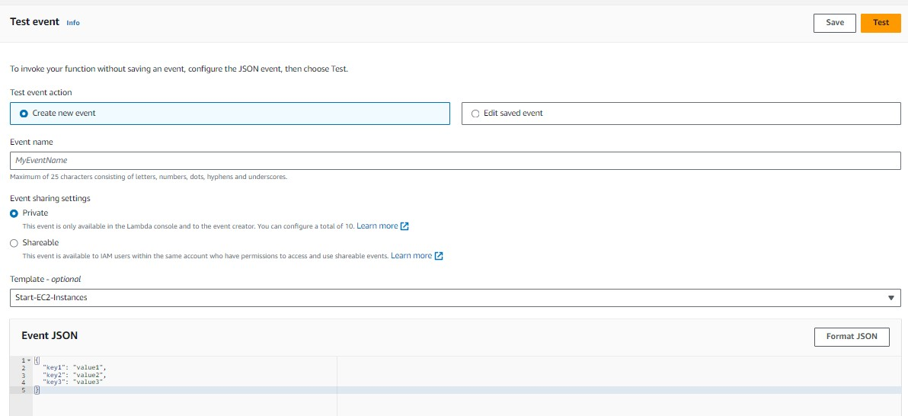

Do same steps to stop instance and consider below code:

```
    import boto3
    region = 'us-west-1'
    instances = ['i-12345cb6de4f78g9h', 'i-08ce9b2d7eccf6d26']
    ec2 = boto3.client('ec2', region_name=region)

    def lambda_handler(event, context):
        ec2.stop_instances(InstanceIds=instances)
        print('stopped your instances: ' + str(instances))
```
Another way you can also add SNS notification by creating SNS topic and SNS Subscribtion and instead of ids you can use environment variables.

```
import boto3
import os

# Get the environment variables
region = os.environ['REGION']
instance_ids = os.environ['INSTANCE_IDS'].split(',')  # Split if multiple instance IDs are comma-separated
sns_topic_arn = os.environ['SNS_TOPIC_ARN']  # Get the SNS Topic ARN

# Create EC2 and SNS clients
ec2 = boto3.client('ec2', region_name=region)
sns = boto3.client('sns', region_name=region)

def lambda_handler(event, context):
    try:
        # Stop instances
        ec2.stop_instances(InstanceIds=instance_ids)
        message = f'Successfully stopped your instances: {instance_ids}'
        print(message)
        
        # Publish success notification to SNS
        sns.publish(
            TopicArn=sns_topic_arn,
            Subject='Lambda Function Success',
            Message=message
        )
    except Exception as e:
        message = f'Failed to stop instances: {str(e)}'
        print(message)
        
        # Publish failure notification to SNS
        sns.publish(
            TopicArn=sns_topic_arn,
            Subject='Lambda Function Failure',
            Message=message
        )
        raise e

```

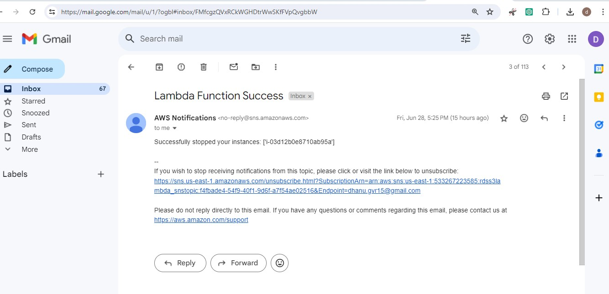

**Configuring EventBridge**

1) create an EventBridge and add a trigger

 * Navigate to  Lambda Console and click on Add Trigger.
 

 * Select the EventBridge (CloudWatch Events)

  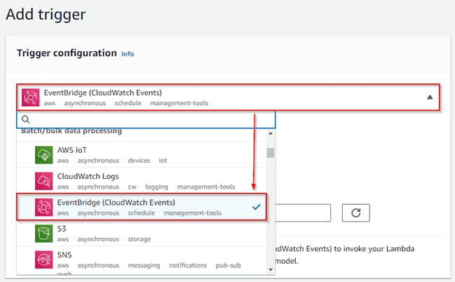
 * Select Create a new rule and Select the Rule type as Schedule expression.
 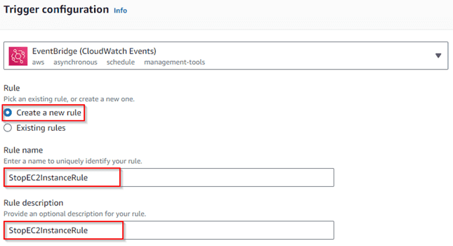
 * Now in the New Google Tab, search for the UTC Time Right Now.
 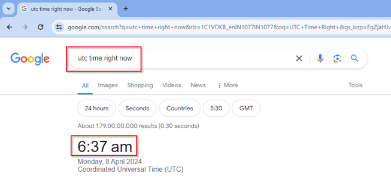
 * we will write the Expression as cron(47 6 ? * * *) for  the instance to be stopped after 10 minutes
 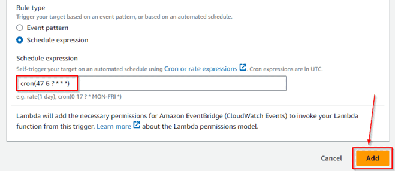

 check scheduled trigger in cinfiguration

 

* We have successfully added the Trigger.

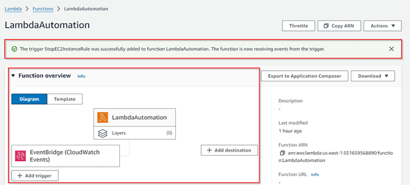


**Verifying the Lambda Function & EventBridge Rule**

Refresh the EC2 Console and you can our EC2 Instance has Stopped Automatically.


    


