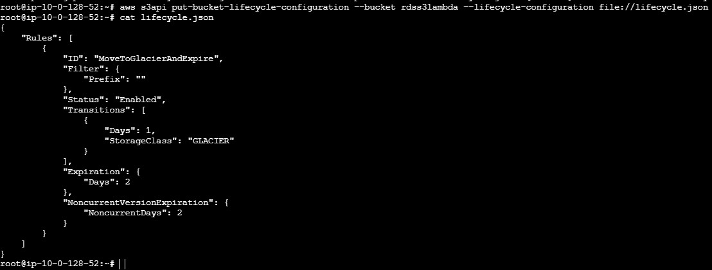

### How to attach LifeCyclePolicy to S3:

**Ans**: Can do manually or Can do AWS CLI using JSON Policy

#### Manual Way:

**Step 1:** Open the S3 Console

1. Sign in to the AWS Management Console.
2. Navigate to the S3 service by selecting "S3" from the services menu.

**Step 2:** Select Your Bucket

1. Find the bucket to which you want to apply the lifecycle policy.
2. Click on the bucket name to open its properties.


**Step 3:** Create a Lifecycle Rule

1. Go to the "Management" tab.
2. Select "Lifecycle rules" from the left-hand menu.
3. Click the "Create lifecycle rule" button.


**Step 4**: Configure the Lifecycle Rule

1. **Enter a rule name**: 

    * Provide a name for your lifecycle rule, e.g., "MoveToGlacierAndDelete".

    * Choose a scope:
        * Select "This rule applies to all objects in the bucket" if you want the rule to apply to all objects.
         
         
        * If you want to apply the rule to a specific prefix or tag, configure the scope accordingly.
          
          
   
3. Add transitions:

    * Click on "Add transition".
    * Under "Choose transition storage class", select "Transition to Glacier".
    * Under "When objects are created", select "Days after object creation" and enter 30.
    

4. Add expiration:
    * Click on "Add expiration".
    * Under "Expire current versions of objects", select "Days after object creation" and enter 365.
5. Review the summary to ensure your settings are correct.
6. Click "Create rule" to save your lifecycle rule.

    

  Result Need to Check After two days.

#### **AWS CLI using JSON Policy**

1. Create an EC2 instance

2. Install awscli in that instance, if ubuntu instance

    ```
    apt update
    apt search awscli
    apt install curl wget unzip -y
    curl "https://awscli.amazonaws.com/awscli-exe-linux-x86_64.zip" -o "awscliv2.zip"
    unzip awscliv2.zip
    ./aws/install
    aws --version
    ```
3. Create a role and attach a S3 full access 

    `AmazonS3FullAccess`

4. Assign that role to ec2 instance.

    Goto Security --> Modify IAM Role --> Attach IAM Role

5. create a json file 

    ```
        {
        "Rules": [
            {
                "ID": "MoveToGlacierAndExpire",
                "Filter": {
                    "Prefix": ""
                },
                "Status": "Enabled",
                "Transitions": [
                    {
                        "Days": 1,
                        "StorageClass": "GLACIER"
                    }
                ],
                "Expiration": {
                    "Days": 2
                },
                "NoncurrentVersionExpiration": {
                    "NoncurrentDays": 2
                }
            }
        ]
    }
    ```
    Create a policy file with lifecycle.json

    ```
    vi lifecycle.json
    
    aws s3api put-bucket-lifecycle-configuration --bucket rdss3lambda --lifecycle-configuration file://lifecycle.json

    ```
    run command by changing Bucketname and Policyname, in the instance

    `aws s3api put-bucket-lifecycle-configuration --bucket <bucket_name> --lifecycle-configuration file://<policy_name.json>`


    

    Go and check in bucket, the policy is sucessfully created to bucket

    

    Need to check after two days, Is policy working or not.


    